# CineView
## Product Requirements Document

---

**Versi Dokumen:** 1.0  
**Tanggal:** 1 Januari 2026  
**Tim Pengembang:** Muhammad Fakhrudin & Ragil Cahyadi  
**Status:** Draft untuk Review

---

## Ringkasan Eksekutif

CineView merupakan aplikasi mobile yang dirancang sebagai pendamping utama bagi penggemar film dalam menemukan, melacak, dan mengulas film favorit mereka. Aplikasi ini menjawab kebutuhan akan platform terpadu yang menggabungkan pencarian informasi film, manajemen daftar tontonan, dan kemampuan berbagi ulasan secara visual dalam satu ekosistem yang terintegrasi.

---

## 1. Analisis 5W + 1H

### What (Apa)
CineView adalah aplikasi mobile berbasis Flutter yang berfungsi sebagai "Movie Companion App" dengan backend Laravel. Aplikasi ini mengintegrasikan data dari TMDB API untuk menyediakan informasi film yang akurat dan up-to-date, dilengkapi dengan fitur personal seperti watchlist, review dengan media visual, dan profil pengguna.

### Who (Siapa)

**Target Pengguna Utama** adalah mahasiswa dan pelajar berusia 17-25 tahun yang aktif menonton film, baik di bioskop maupun platform streaming. Mereka terbiasa menggunakan smartphone sebagai alat utama untuk mengakses informasi dan berbagi pengalaman.

**Target Pengguna Sekunder** mencakup casual viewers dari berbagai kalangan usia yang membutuhkan tempat sederhana untuk menyimpan rekomendasi film dan mendapatkan informasi cepat tentang film yang sedang tayang.

### When (Kapan)
Pengembangan dimulai pada 1 Januari 2026 dengan target rilis MVP pada 11 Januari 2026. Timeline ini disesuaikan dengan kebutuhan akademik dan scope fitur yang telah diprioritaskan.

### Where (Di mana)
Aplikasi akan tersedia untuk perangkat Android melalui file APK yang dapat didistribusikan secara langsung. Pengembangan backend menggunakan server dengan Laravel Sanctum untuk autentikasi.

### Why (Mengapa)
Industri hiburan saat ini memproduksi ratusan judul film setiap tahunnya, menciptakan kondisi "information overload" bagi penonton. Pengguna memerlukan solusi yang menyederhanakan proses pencarian, penyimpanan, dan berbagi pengalaman menonton mereka dalam satu platform yang intuitif.

### How (Bagaimana)
CineView dibangun menggunakan arsitektur clean architecture pada sisi mobile (Flutter) dan RESTful API pada backend (Laravel). Integrasi dengan TMDB API memastikan data film selalu akurat dan terkini, sementara fitur kamera dan image picker memungkinkan pengguna melampirkan bukti visual dalam ulasan mereka.

---

## 2. Pernyataan Masalah

### 2.1 Permasalahan Utama

Penggemar film saat ini tidak memiliki satu platform terpadu yang dapat mengakomodasi kebutuhan lengkap mereka — mulai dari mencari informasi film, menyimpan daftar tontonan, hingga berbagi pengalaman menonton secara ekspresif. Fragmentasi ini memaksa pengguna untuk berpindah-pindah antara berbagai aplikasi dan metode pencatatan manual yang tidak efisien.

### 2.2 Situasi Terkini

Saat ini, perilaku pengguna dalam mengkonsumsi konten film dapat digambarkan sebagai berikut:

Ketika seseorang mendapatkan rekomendasi film dari teman atau melihat trailer menarik di media sosial, mereka biasanya menyimpan judul tersebut di aplikasi notes atau mengandalkan ingatan. Ketika akhirnya memiliki waktu luang untuk menonton, tidak sedikit yang lupa judul film tersebut atau kehilangan catatan yang sudah dibuat.

Untuk mencari informasi tentang film yang ingin ditonton, pengguna harus membuka beberapa aplikasi berbeda — satu untuk trailer, satu untuk sinopsis, dan lainnya untuk membaca review. Proses ini memakan waktu dan seringkali membuat pengguna frustrasi.

Setelah menonton film, keinginan untuk berbagi pengalaman terbatas pada posting media sosial yang tidak terintegrasi dengan database film, atau review berbasis teks di platform seperti IMDB yang tidak mendukung konten visual personal seperti foto tiket atau suasana menonton.

### 2.3 Akar Masalah

Tiga faktor fundamental yang menyebabkan permasalahan ini:

**Pertama**, tidak adanya ekosistem yang menghubungkan fase "discovery" (menemukan film) dengan fase "consumption" (menonton) dan fase "sharing" (berbagi pengalaman). Setiap fase saat ini ditangani oleh platform yang berbeda dan tidak saling terhubung.

**Kedua**, platform review film yang ada dirancang dengan pendekatan database-centric, bukan user-centric. Fokus utama adalah mengumpulkan rating dan review untuk kepentingan agregasi, bukan memfasilitasi pengguna dalam mendokumentasikan dan berbagi pengalaman personal mereka.

**Ketiga**, solusi pencatatan yang ada (notes, spreadsheet, atau bookmark) tidak terintegrasi dengan informasi film yang akurat dan real-time, sehingga pengguna harus melakukan input manual berulang kali.

### 2.4 Dampak Jika Tidak Diselesaikan

Tanpa solusi yang tepat, pengguna akan terus mengalami:

**Kehilangan momen menonton** — Film yang direkomendasikan akan terlupakan, dan pengguna melewatkan kesempatan menonton konten yang mungkin sangat mereka nikmati. Dalam jangka panjang, ini mengurangi kepuasan dalam mengkonsumsi media hiburan.

**Waktu terbuang** — Proses pencarian informasi yang terfragmentasi menghabiskan waktu yang seharusnya bisa digunakan untuk aktivitas lain. Ketidakefisiensian ini terakumulasi seiring waktu.

**Hilangnya dokumentasi pengalaman** — Kenangan menonton film yang seharusnya bisa diabadikan secara terstruktur menjadi terlupakan. Pengguna kehilangan kesempatan untuk melihat kembali journey mereka sebagai penikmat film.

---

## 3. Solusi yang Ditawarkan

CineView hadir sebagai "One-Stop Movie Companion" yang mengintegrasikan tiga fungsi utama dalam satu platform:

**Discovery Hub** — Pengguna dapat menjelajahi film yang sedang tayang, film populer, dan melakukan pencarian berdasarkan judul atau genre. Semua informasi termasuk sinopsis, cast, rating, dan trailer tersedia dalam satu tempat.

**Personal Watchlist** — Sistem pencatatan yang terintegrasi langsung dengan database film. Dengan satu tap, pengguna dapat menyimpan film ke daftar tontonan tanpa perlu mengetik ulang informasi apapun.

**Visual Journal** — Fitur review yang tidak hanya mendukung teks dan rating, tetapi juga memungkinkan pengguna melampirkan foto sebagai bukti atau kenangan dari pengalaman menonton. Review dapat diekspor menjadi PDF sebagai dokumentasi personal.

---

## 4. Entity Relationship Diagram

```mermaid
erDiagram
    USERS {
        int id PK
        string name
        string email UK
        string password
        string profile_photo
        timestamp created_at
        timestamp updated_at
    }
    
    WATCHLISTS {
        int id PK
        int user_id FK
        int movie_id
        string movie_title
        string poster_path
        timestamp added_at
    }
    
    REVIEWS {
        int id PK
        int user_id FK
        int movie_id
        string movie_title
        float rating
        text content
        string photo_path
        timestamp created_at
        timestamp updated_at
    }
    
    TOKENS {
        int id PK
        int user_id FK
        string token
        string abilities
        timestamp expires_at
    }

    USERS ||--o{ WATCHLISTS : "memiliki"
    USERS ||--o{ REVIEWS : "membuat"
    USERS ||--o{ TOKENS : "memiliki"
```



Diagram di atas menunjukkan empat entitas utama dalam sistem CineView. Tabel **USERS** menyimpan data pengguna termasuk informasi autentikasi dan profil. **WATCHLISTS** mencatat film yang disimpan pengguna untuk ditonton nanti, dengan referensi ke movie_id dari TMDB API. **REVIEWS** menyimpan ulasan yang dibuat pengguna, termasuk rating numerik, konten teks, dan path ke foto yang dilampirkan. **TOKENS** mengelola sesi autentikasi menggunakan Laravel Sanctum.

---

## 5. User Flow


Diagram di atas menggambarkan alur pengguna secara menyeluruh. Dimulai dari proses **Authentication** (buka aplikasi, splash screen, login/registrasi), pengguna yang berhasil login akan diarahkan ke **Home Page** sebagai pusat navigasi. Dari sini, pengguna dapat mengakses berbagai fitur seperti melihat film, melakukan pencarian, mengelola watchlist, dan mengakses profil. Setiap interaksi dengan film mengarah ke **Detail Film** dimana pengguna dapat memberikan review dengan opsi melampirkan foto.

---

## 6. Spesifikasi Fitur

### 6.1 Fitur Prioritas Kritis (P0)

| ID | Fitur | Deskripsi |
|:---|:------|:----------|
| FR-01 | Authentication | Sistem login dan registrasi dengan validasi form dan penyimpanan token menggunakan Laravel Sanctum |
| FR-02 | Home Page | Tampilan utama dengan section Now Playing, Popular Films, dan Top Actors yang diambil dari TMDB API |
| FR-03 | Movie Detail | Halaman detail dengan hero image, informasi lengkap film, rating, overview, genre, dan daftar cast |
| FR-04 | Watchlist | Kemampuan menambah dan menghapus film dari daftar tontonan personal |
| FR-05 | Search & Explore | Pencarian film berdasarkan judul dengan filter kategori genre |
| FR-06 | Review & Rating | Form input review dengan rating bintang (1-10) dan field ulasan teks |
| FR-07 | Visual Review | Integrasi kamera dan image picker untuk melampirkan foto dalam review |
| FR-08 | Profile | Halaman profil menampilkan informasi user, statistik, dan akses ke pengaturan |

### 6.2 Fitur Prioritas Penting (P1)

| ID | Fitur | Deskripsi |
|:---|:------|:----------|
| FR-09 | Edit Profile | Form untuk mengubah nama, email, nomor telepon, dan foto profil |
| FR-10 | Trailer Integration | Section Hot Trailer dengan kemampuan memutar video trailer film |
| FR-11 | Change Password | Alur ganti password dengan validasi password lama dan konfirmasi password baru |
| FR-12 | Actor Detail | Halaman khusus menampilkan biografi dan filmografi aktor |
| FR-13 | Export PDF | Fungsi untuk mengekspor kumpulan review menjadi dokumen PDF |

### 6.3 Fitur Prioritas Tambahan (P2)

| ID | Fitur | Deskripsi |
|:---|:------|:----------|
| FR-14 | FAQ & Support | Halaman informasi statis untuk pertanyaan umum dan bantuan |
| FR-15 | Splash Screen | Tampilan branding saat aplikasi pertama kali dibuka |
| FR-16 | Review App Popup | Dialog untuk mengumpulkan feedback pengguna terhadap aplikasi |

---

## 7. Referensi Desain

````carousel

<!-- slide -->

<!-- slide -->

<!-- slide -->

<!-- slide -->

````

---

## 8. Timeline Pengembangan

| Fase | Tanggal | PIC | Deliverables |
|:-----|:--------|:----|:-------------|
| **Setup & Foundation** | 1 Jan 2026 | Fakhrudin, Ragil | Project structure, database migration, splash screen |
| **Authentication** | 2 Jan 2026 | Fakhrudin, Ragil | API auth (Sanctum), UI login/register, token storage |
| **Home & Navigation** | 3 Jan 2026 | Fakhrudin | TMDB service, navbar, home page dengan data API |
| **Detail Pages** | 3-4 Jan 2026 | Ragil | UI detail film, detail actor, parsing JSON response |
| **Search Feature** | 5 Jan 2026 | Fakhrudin, Ragil | Explore page, search logic, genre filter |
| **Watchlist System** | 6 Jan 2026 | Fakhrudin | API CRUD watchlist, UI collection, toggle button |
| **Review Feature** | 7 Jan 2026 | Ragil | API post review, form input, rating bar |
| **Camera Integration** | 8 Jan 2026 | Fakhrudin | Image picker, upload handler, preview foto |
| **Profile Management** | 9 Jan 2026 | Fakhrudin, Ragil | API update profile, UI settings, change password |
| **Extra Features** | 10 Jan 2026 | Fakhrudin, Ragil | PDF export, FAQ page, UI polish |
| **Testing & Release** | 11 Jan 2026 | Fakhrudin, Ragil | API testing (Postman), end-to-end testing, build APK |

---

## 9. Teknologi yang Digunakan

**Mobile Application**
- Framework: Flutter (Dart)
- Architecture: Clean Architecture
- State Management: Provider/Bloc
- HTTP Client: Dio/HTTP Package

**Backend Services**
- Framework: Laravel (PHP)
- Authentication: Laravel Sanctum
- Database: MySQL
- API Design: RESTful

**External Integration**
- Movie Database: TMDB API (The Movie Database)
- Image Storage: Local server filesystem

---

## 10. Success Metrics

Keberhasilan CineView akan diukur berdasarkan:

**Adoption Rate** — Jumlah pengguna yang berhasil menyelesaikan registrasi dan melakukan setidaknya satu aksi meaningful (menambah watchlist atau membuat review) dalam 7 hari pertama.

**Engagement** — Rata-rata jumlah film yang ditambahkan ke watchlist per pengguna aktif dan rata-rata review yang dibuat per minggu.

**Feature Utilization** — Persentase review yang menggunakan fitur visual (lampiran foto) dibandingkan total review.

**Retention** — Persentase pengguna yang kembali menggunakan aplikasi setelah 7 hari dan 30 hari sejak registrasi.


## 11. Architecture Folder Structure untuk CineView (Flutter)

```
lib/
├── main.dart
├── core/   
│   ├── constants/
│   │   ├── api_constants.dart
│   │   └── app_constants.dart
│   ├── errors/
│   │   ├── exceptions.dart
│   │   └── failures.dart
│   ├── network/
│   │   └── api_client.dart
│   ├── theme/
│   │   ├── app_colors.dart
│   │   ├── app_text_styles.dart
│   │   └── app_theme.dart
│   └── utils/
│       └── helpers.dart
│
├── data/
│   ├── datasources/
│   │   ├── local/
│   │   │   └── local_storage.dart
│   │   └── remote/
│   │       ├── auth_remote_datasource.dart
│   │       ├── movie_remote_datasource.dart
│   │       ├── review_remote_datasource.dart
│   │       └── watchlist_remote_datasource.dart
│   ├── models/
│   │   ├── user_model.dart
│   │   ├── movie_model.dart
│   │   ├── review_model.dart
│   │   └── watchlist_model.dart
│   └── repositories/
│       ├── auth_repository_impl.dart
│       ├── movie_repository_impl.dart
│       ├── review_repository_impl.dart
│       └── watchlist_repository_impl.dart
│
├── domain/
│   ├── entities/
│   │   ├── user.dart
│   │   ├── movie.dart
│   │   ├── review.dart
│   │   └── watchlist.dart
│   ├── repositories/
│   │   ├── auth_repository.dart
│   │   ├── movie_repository.dart
│   │   ├── review_repository.dart
│   │   └── watchlist_repository.dart
│   └── usecases/
│       ├── auth/
│       │   ├── login_usecase.dart
│       │   └── register_usecase.dart
│       ├── movie/
│       │   ├── get_now_playing_usecase.dart
│       │   ├── get_popular_movies_usecase.dart
│       │   └── search_movies_usecase.dart
│       ├── review/
│       │   ├── create_review_usecase.dart
│       │   └── get_user_reviews_usecase.dart
│       └── watchlist/
│           ├── add_to_watchlist_usecase.dart
│           ├── remove_from_watchlist_usecase.dart
│           └── get_watchlist_usecase.dart
│
└── presentation/
    ├── providers/
    │   ├── auth_provider.dart
    │   ├── movie_provider.dart
    │   ├── review_provider.dart
    │   └── watchlist_provider.dart
    ├── pages/
    │   ├── splash/
    │   │   └── splash_page.dart
    │   ├── auth/
    │   │   ├── login_page.dart
    │   │   └── register_page.dart
    │   ├── home/
    │   │   └── home_page.dart
    │   ├── explore/
    │   │   └── explore_page.dart
    │   ├── watchlist/
    │   │   └── watchlist_page.dart
    │   ├── profile/
    │   │   ├── profile_page.dart
    │   │   └── edit_profile_page.dart
    │   ├── movie_detail/
    │   │   └── movie_detail_page.dart
    │   ├── actor_detail/
    │   │   └── actor_detail_page.dart
    │   └── review/
    │       └── create_review_page.dart
    └── widgets/
        ├── common/
        │   ├── custom_button.dart
        │   ├── custom_text_field.dart
        │   └── loading_widget.dart
        └── movie/
            ├── movie_card.dart
            ├── movie_list.dart
            └── actor_card.dart
```

*Dokumen ini akan diperbarui seiring perkembangan proyek. Versi terakhir selalu menjadi acuan utama untuk tim pengembangan.*